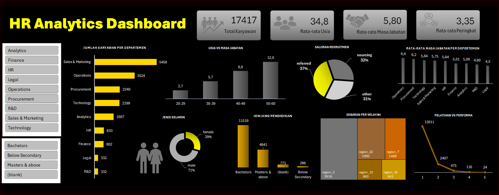

# 💼 HR Analytics Dashboard — Excel (2025)

📊 **Tools:** Microsoft Excel (Power Query, Pivot Chart, Conditional Formatting)
📂 **Dataset:** Employee records (17,000+ entries)

---

## 🎯 **Project Overview**

This project focuses on analyzing employee data to uncover patterns in **age, tenure, recruitment channels, education levels**, and **performance metrics**.
The dashboard was designed using **Microsoft Excel** with a professional **black–yellow theme**, focusing on clarity, insight, and storytelling.

---

## ⚙️ **Objectives**

* Understand employee demographics and tenure distribution
* Identify the most effective recruitment channels
* Explore the relationship between **age** and **length of service**
* Visualize education levels and performance across departments

---

## 🔍 **Key Insights**

* 👥 **Total employees:** 17,417
* 🧓 **Average age:** 34.8 years | **Average tenure:** 5.8 years
* 🏢 **Largest department:** Sales & Marketing (5,458 employees)
* ⏳ **Longest tenure:** Employees aged 50–60 (average 12 years)
* 💼 **Recruitment source:** 37% referral, 32% sourcing, 31% other
* 🎓 **Education level:** 66% Bachelor's degree, 28% Master's and above
* ⚧️ **Gender:** 71% male, 29% female
* 📈 **Training vs Performance:** Most employees (13,000+) attended 1 training

---

## 🧩 **Dashboard Features**

* Interactive Excel dashboard using **Pivot Tables and Power Query**
* Custom color theme (**black–yellow**) for modern visual clarity
* Clean layout showcasing HR metrics (department size, gender ratio, tenure trends)
* KPI cards summarizing **key HR indicators** at the top

---

## 📸 **Preview**

---

## 🧠 **What I Learned**

* Data cleaning and transformation using Power Query
* Building interactive dashboards with Excel visuals
* Data storytelling for HR metrics
* Designing with a professional color palette (contrast & accessibility)

---

✨ *Created by [Silvi Indah Lestari](https://github.com/indahsilvi393-lang)*
📅 *Last updated: 2025*

